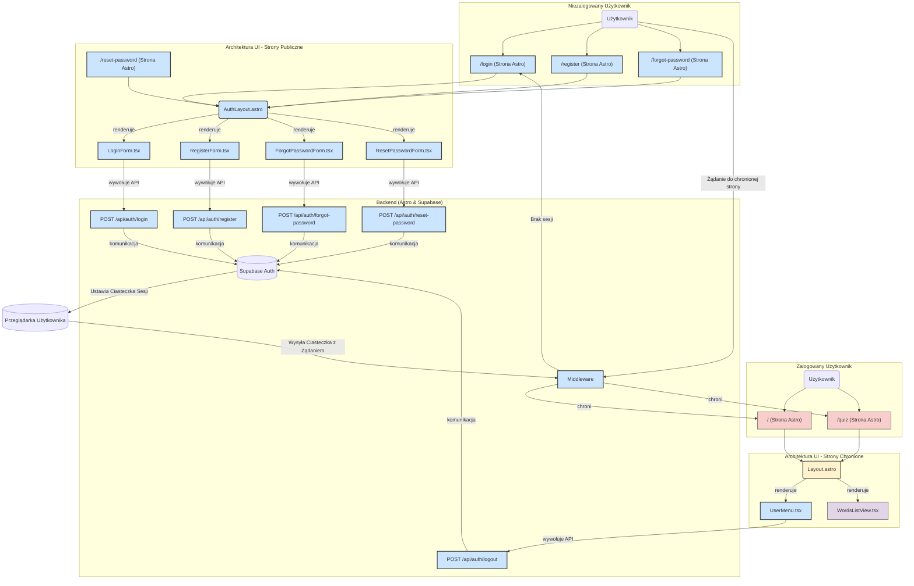

<architecture_analysis>
Na podstawie analizy dokumentu `auth-spec.md` oraz `5-prd.md`, zidentyfikowano następujące elementy, które zostaną wprowadzone w ramach modułu autentykacji. Obecna struktura projektu nie zawiera dedykowanych komponentów autentykacji, więc wszystkie poniższe elementy są nowe lub wymagają modyfikacji.

### 1. Komponenty, Strony i Layouty

- **Layouts (Astro)**
  - `src/layouts/Layout.astro` (Modyfikacja): Główny layout dla zalogowanych użytkowników. Zostanie rozszerzony o logikę warunkową wyświetlającą `UserMenu.tsx` dla zalogowanych użytkowników.
  - `src/layouts/AuthLayout.astro` (Nowy): Minimalistyczny layout dla stron publicznych (logowanie, rejestracja, reset hasła), pozbawiony nawigacji dla zalogowanych użytkowników.

- **Strony (Astro)**
  - `src/pages/login.astro` (Nowa): Strona logowania, osadzająca komponent `LoginForm.tsx` i wykorzystująca `AuthLayout.astro`.
  - `src/pages/register.astro` (Nowa): Strona rejestracji, osadzająca `RegisterForm.tsx` i wykorzystująca `AuthLayout.astro`.
  - `src/pages/forgot-password.astro` (Nowa): Strona do inicjowania resetu hasła, osadzająca `ForgotPasswordForm.tsx`.
  - `src/pages/reset-password.astro` (Nowa): Strona do ustawiania nowego hasła, osadzająca `ResetPasswordForm.tsx`.
  - `src/pages/index.astro` (Modyfikacja): Strona główna (lista słówek), która będzie teraz chroniona i dostępna tylko dla zalogowanych użytkowników.

- **Komponenty (React)**
  - `src/components/auth/LoginForm.tsx` (Nowy): Formularz logowania z walidacją i obsługą komunikacji z `/api/auth/login`.
  - `src/components/auth/RegisterForm.tsx` (Nowy): Formularz rejestracji z walidacją i obsługą komunikacji z `/api/auth/register`.
  - `src/components/auth/ForgotPasswordForm.tsx` (Nowy): Formularz do wysyłania prośby o reset hasła.
  - `src/components/auth/ResetPasswordForm.tsx` (Nowy): Formularz do ustawiania nowego hasła.
  - `src/components/layout/UserMenu.tsx` (Nowy): Komponent w nagłówku, wyświetlający e-mail użytkownika i przycisk wylogowania.

- **Logika backendowa**
  - `src/middleware/index.ts` (Nowy): Middleware Astro do ochrony tras. Przechwytuje żądania, weryfikuje sesję użytkownika i dokonuje przekierowań.
  - `src/pages/api/auth/` (Nowe): Endpointy API (`login`, `register`, `logout`, `forgot-password`, `reset-password`) działające jako warstwa pośrednicząca między frontendem a Supabase.

### 2. Główne strony i ich komponenty

- **Strona Logowania (`/login`)**:
  - Layout: `AuthLayout.astro`
  - Komponent: `LoginForm.tsx`
- **Strona Rejestracji (`/register`)**:
  - Layout: `AuthLayout.astro`
  - Komponent: `RegisterForm.tsx`
- **Strona Główna (`/`)**:
  - Layout: `Layout.astro`
  - Komponenty: `WordsListView.tsx`, `UserMenu.tsx` (w layoucie)
- **Strony Resetowania Hasła**:
  - Layout: `AuthLayout.astro`
  - Komponenty: `ForgotPasswordForm.tsx`, `ResetPasswordForm.tsx`

### 3. Przepływ Danych

1.  Użytkownik wchodzi na chronioną stronę (np. `/`) bez aktywnej sesji.
2.  `Middleware` przechwytuje żądanie, stwierdza brak sesji i przekierowuje użytkownika na `/login`.
3.  Użytkownik wchodzi na stronę `/login`, która renderuje `LoginForm.tsx` wewnątrz `AuthLayout.astro`.
4.  Formularz React (`LoginForm.tsx`) wysyła dane uwierzytelniające do endpointu `POST /api/auth/login`.
5.  Endpoint API komunikuje się z Supabase, aby zweryfikować dane.
6.  W przypadku sukcesu, Supabase ustawia w przeglądarce ciasteczka sesyjne (HTTP-only).
7.  Frontend przekierowuje użytkownika na stronę główną (`/`).
8.  Teraz, gdy użytkownik ma sesję, `Middleware` zezwala na dostęp.
9.  Główny layout (`Layout.astro`) renderuje komponent `UserMenu.tsx`, który pozwala na wylogowanie.
10. Kliknięcie "Wyloguj" w `UserMenu.tsx` wywołuje `POST /api/auth/logout`, które niszczy sesję w Supabase, a użytkownik jest przekierowywany z powrotem do `/login`.

</architecture_analysis>

<mermaid_diagram>

</mermaid_diagram>

## Diagram Architektury UI

