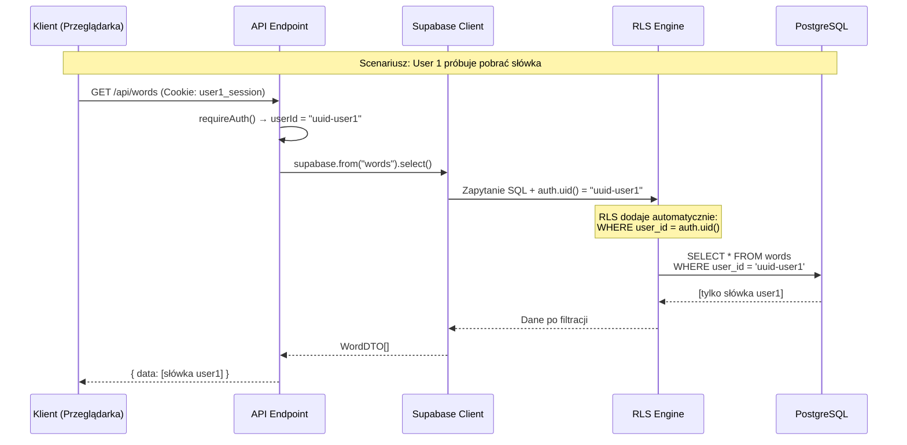
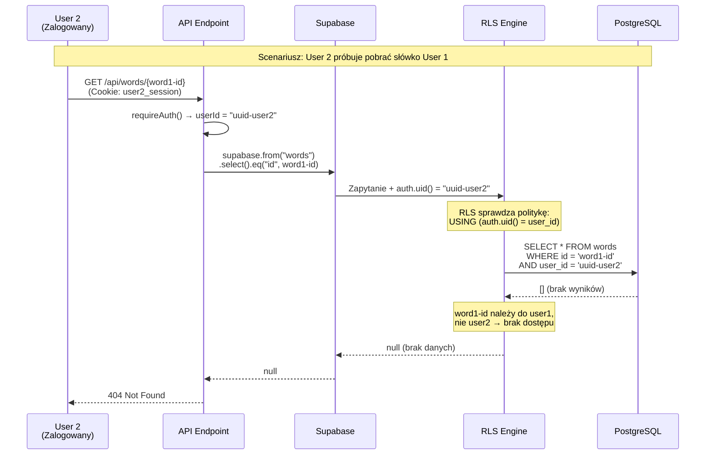
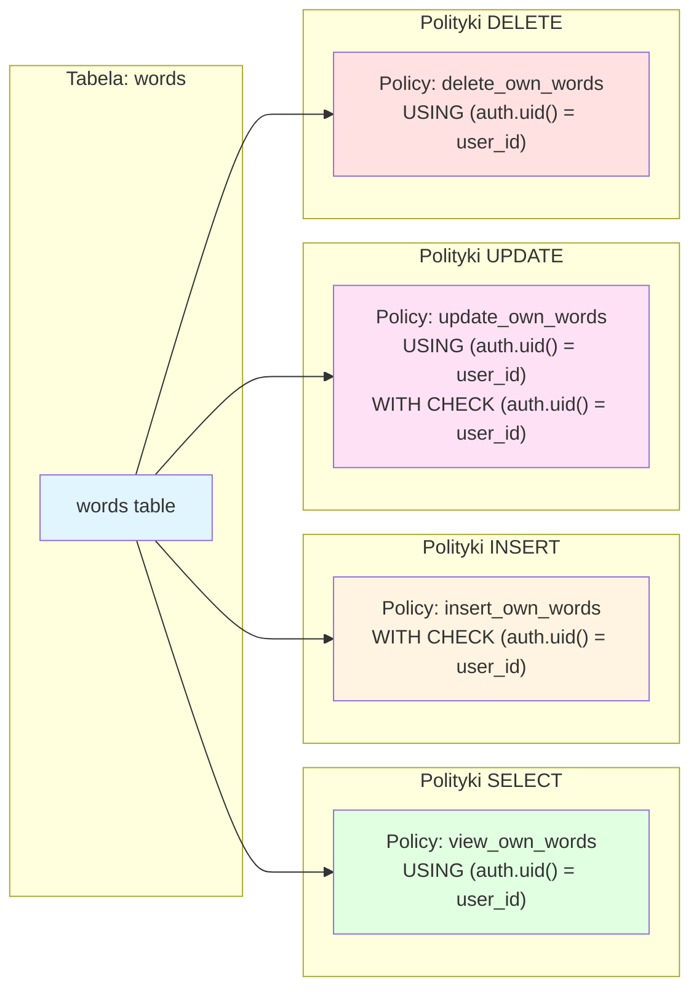
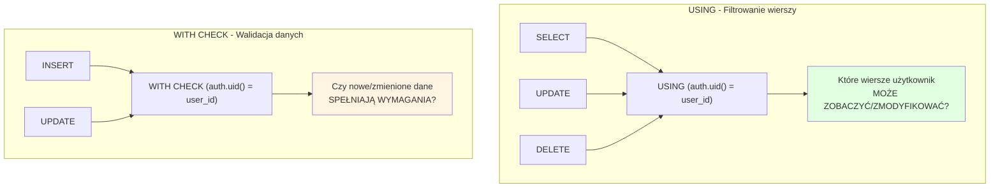
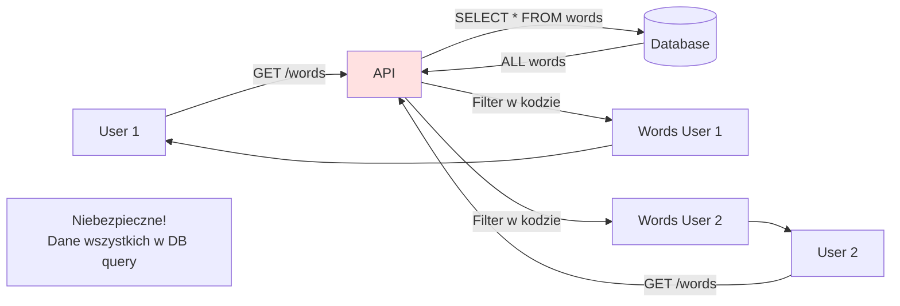
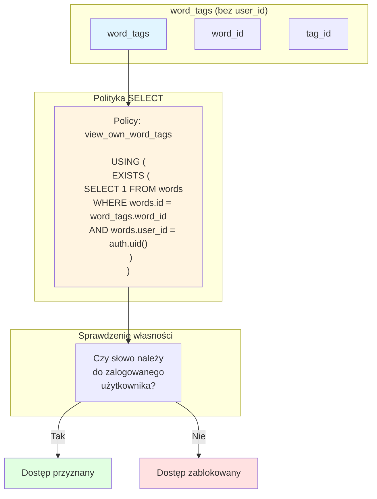

# Diagramy RLS - Row Level Security

## 📊 Diagram 1: Jak działa RLS?



---

## 🔒 Diagram 2: RLS blokuje nieautoryzowany dostęp



---

## 🛡️ Diagram 3: Warstwy bezpieczeństwa (Defense in Depth)

```mermaid
graph TB
    subgraph "Warstwa 1: Autentykacja"
        A[Client Request] --> B{Zalogowany?}
        B -->|Nie| C[401 Unauthorized]
        B -->|Tak| D[userId z tokenu]
    end

    subgraph "Warstwa 2: Kod Aplikacji"
        D --> E[WordService]
        E --> F[".eq('user_id', userId)"]
        F --> G[Filtrowanie w kodzie]
    end

    subgraph "Warstwa 3: RLS (Baza Danych)"
        G --> H[Supabase Client]
        H --> I[RLS Policies]
        I --> J{auth.uid() = user_id?}
        J -->|Nie| K[Brak dostępu]
        J -->|Tak| L[Dostęp przyznany]
    end

    L --> M[PostgreSQL]
    M --> N[Zwrot danych]

    style A fill:#e1f5ff
    style C fill:#ffe1e1
    style K fill:#ffe1e1
    style N fill:#e1ffe1
    style I fill:#fff4e1
```

---

## 📋 Diagram 4: Polityki RLS dla różnych operacji



---

## 🔍 Diagram 5: Różnica między USING i WITH CHECK



---

## 🎯 Diagram 6: Przepływ danych przed i po RLS

### Przed RLS (Niebezpieczne)



### Po RLS (Bezpieczne)

```mermaid
graph LR
    U1[User 1] -->|GET /words<br/>auth.uid() = user1| API[API]
    U2[User 2] -->|GET /words<br/>auth.uid() = user2| API

    API -->|Query + RLS| RLS{RLS Engine}

    RLS -->|SELECT WHERE user_id=user1| DB[(Database)]
    RLS -->|SELECT WHERE user_id=user2| DB

    DB -->|ONLY User 1 words| RLS
    DB -->|ONLY User 2 words| RLS

    RLS --> U1
    RLS --> U2

    style RLS fill:#e1ffe1
    Note1[Bezpieczne!<br/>Izolacja na poziomie DB]
```

---

## 📊 Diagram 7: Polityka dla word_tags (relacyjna)



---

## 🎓 Kluczowe Pojęcia

| Pojęcie        | Opis                                                        | Przykład                                      |
| -------------- | ----------------------------------------------------------- | --------------------------------------------- |
| **RLS**        | Row Level Security - filtrowanie wierszy na poziomie bazy   | Automatyczne `WHERE user_id = auth.uid()`     |
| **auth.uid()** | Funkcja Supabase zwracająca ID zalogowanego użytkownika     | `'550e8400-e29b-41d4-a716-446655440000'`      |
| **USING**      | Określa które wiersze użytkownik może zobaczyć/zmodyfikować | `USING (auth.uid() = user_id)`                |
| **WITH CHECK** | Waliduje czy nowe/zmienione dane spełniają wymagania        | `WITH CHECK (auth.uid() = user_id)`           |
| **Policy**     | Reguła RLS definiująca uprawnienia                          | `create policy "name" on table for select...` |

---

## 🔐 Porównanie: Z RLS vs Bez RLS

| Aspekt             | Bez RLS                           | Z RLS                            |
| ------------------ | --------------------------------- | -------------------------------- |
| **Bezpieczeństwo** | ⚠️ Tylko w kodzie aplikacji       | ✅ Na poziomie bazy danych       |
| **Omijanie**       | ❌ Możliwe przez błędy w kodzie   | ✅ Niemożliwe                    |
| **Zapytania SQL**  | ❌ Zwracają wszystkie dane        | ✅ Automatycznie filtrowane      |
| **Kod aplikacji**  | ⚠️ Musi zawsze filtrować          | ✅ Może, ale nie musi            |
| **Testy**          | ⚠️ Trzeba testować każdy endpoint | ✅ Wystarczy przetestować RLS    |
| **Wydajność**      | ⚠️ Filtrowanie w aplikacji        | ✅ Filtrowanie w bazie (szybsze) |

---

## 📚 Dodatkowe Zasoby

- [Supabase RLS Documentation](https://supabase.com/docs/guides/auth/row-level-security)
- [PostgreSQL RLS Documentation](https://www.postgresql.org/docs/current/ddl-rowsecurity.html)
- [RLS Best Practices](https://supabase.com/docs/guides/database/postgres/row-level-security)
